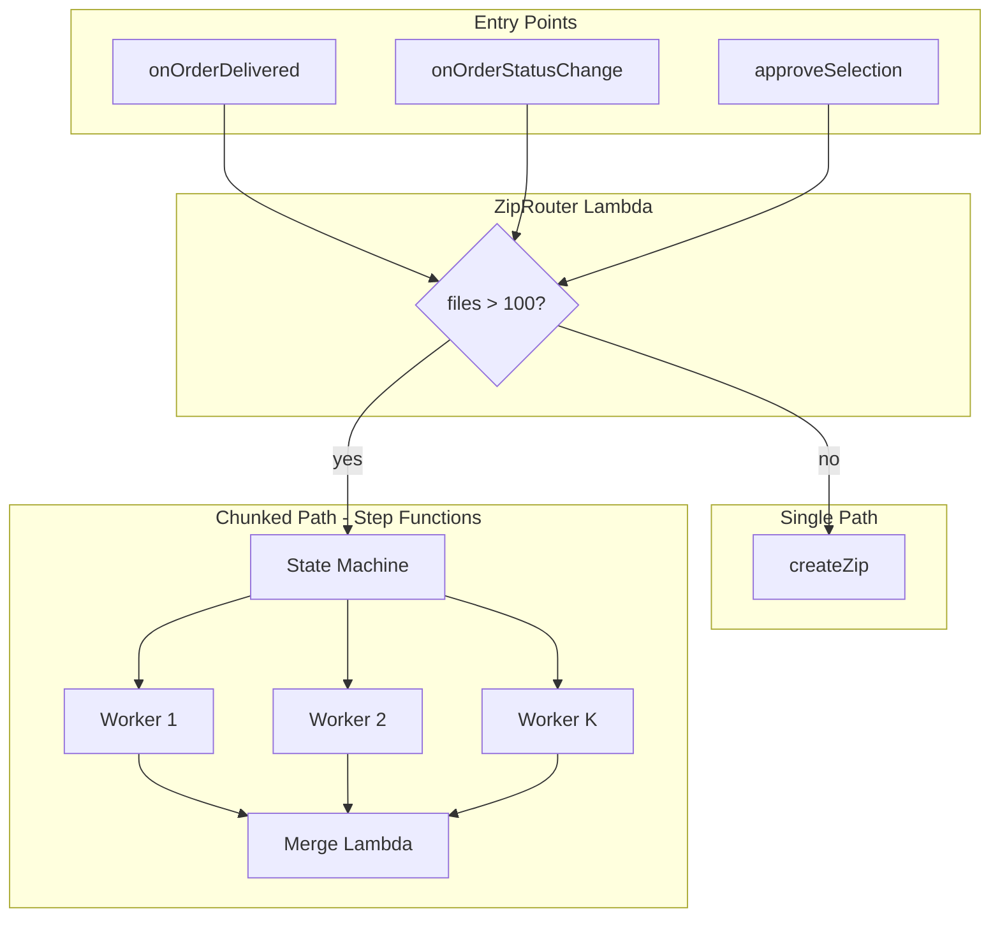

# ZIP Generation Architecture

This document describes the chunked ZIP generation architecture for handling large orders (100+ files) reliably within AWS Lambda's 15-minute timeout limit.

## Overview

ZIP generation uses a **router** that dispatches to either:

- **Single Lambda path** (≤100 files): Existing `createZip` Lambda processes all files in one run.
- **Chunked path** (>100 files): Step Functions orchestrates parallel **chunk workers** that each build a partial ZIP, then a **merge** Lambda streams them into one final ZIP.

## Architecture Diagram



## When Single vs Chunked Is Used

| File count | Path    | Behavior                                                                 |
|------------|---------|--------------------------------------------------------------------------|
| ≤100       | Single  | One `createZip` Lambda run. Same as before chunked was introduced.       |
| >100       | Chunked | Step Function: parallel workers (~100 files each) → merge into final ZIP.|

The threshold is configurable via `ZIP_CHUNK_THRESHOLD` (default: 100).

## Chunk Count Formula

```
workerCount = min(ceil(filesCount / 200), 10)
```

Each worker handles roughly 200 files. Maximum 10 workers for cost control. Example: 1000 files → 5 workers. Example: 350 files → 2 workers.

## Temp Storage

Chunk ZIPs are written to S3 under:

```
s3://bucket/galleries/{galleryId}/zips/tmp/{orderId}-chunk-{index}.zip
```

They are deleted by the merge Lambda after the final ZIP is written.

**Future optimization**: S3 Express One Zone can be used for temp chunks if merge latency is a bottleneck (requires VPC + same AZ, higher storage cost).

## Merge Strategy

The merge Lambda:

1. Creates an S3 multipart upload for the final ZIP (50 MB parts for fewer UploadPart calls).
2. Processes chunks sequentially (parallel was tried but caused ~2.5× slowdown due to archiver contention).
3. Completes multipart upload.
4. Deletes temp chunk objects.
5. Clears `finalZipGenerating` or `zipGenerating` in DynamoDB.

Merge runs with 3008 MB memory (account max) for ~3× CPU. All operations are streamed; no full ZIP buffering in memory.

## Metrics and Monitoring

- **ZipMetrics DynamoDB table**: Each run (single or chunked) writes metrics: `runId`, `phase`, `durationMs`, `bottleneck`, `config`, `success`, etc.
- **Dev dashboard**: `/dev/zip-metrics` shows raw metrics, summary stats, bottleneck distribution, and CSV export.
- **CloudWatch alarms**: DLQ messages, Step Function failures, ZipMerge Lambda errors.

See [zip-generation-monitoring.md](zip-generation-monitoring.md) for details.

## Cost Notes

- **Single path**: 1× createZip invocation (up to 15 min, 1024 MB).
- **Chunked path**: N workers (parallel) + 1 merge. Example: 300 files → 3 workers + 1 merge ≈ 4× single-run cost, but completes instead of timing out.
- S3: Standard storage for final ZIP; temp chunks are short-lived and deleted after merge.

## Troubleshooting

### DLQ has messages

Failed async Lambda invocations (createZip or chunk workers) land in `ZipGenerationDLQ`. Check CloudWatch Logs for the corresponding Lambda; use retry or admin tools to re-trigger.

### Step Function execution failed

Check the Step Functions console for the execution ID. Failed states show which step (Map iteration or Merge) failed. Common causes: worker timeout, S3 errors, merge timeout.

### Lambda 429 (TooManyRequestsException)

If many workers start at once, Lambda can throttle. The Map state uses `maxConcurrency: 4` to cap concurrent workers. For accounts with higher limits, you can increase this in `app-stack.ts`; otherwise request a concurrency limit increase from AWS.

### Merge timeout

If merge exceeds 15 minutes (very large ZIPs), consider increasing chunk count so workers produce smaller chunks, or evaluate S3 Express / different merge strategy.

### Order stuck in "generating"

- **EventBridge failure handler**: When the Step Function fails, EventBridge triggers `ZipChunkedFailureHandlerFn`, which clears the flag and sets the error state. The UI then shows "error" with a retry button.
- **Stale detection**: If generating for >25 min with no ZIP, `getZipStatus` / `getFinalZipStatus` return `status: "error"` (fallback if the failure handler didn't run).
- **Manual recovery**: Use the admin retry endpoint or manually clear `finalZipGenerating` / `zipGenerating` in DynamoDB and re-trigger generation.

## Related

- [zip-generation-monitoring.md](zip-generation-monitoring.md) – Monitoring, alarms, dev dashboard
- [cloudfront-zip-downloads-setup.md](cloudfront-zip-downloads-setup.md) – ZIP downloads via CloudFront
